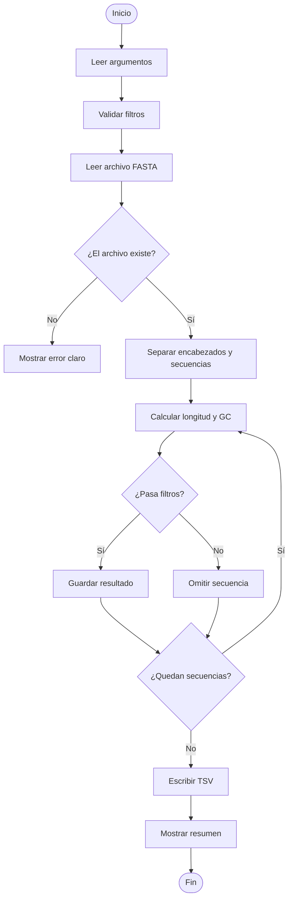

# Diseño del Analizador de Secuencias FASTA

## Objetivo del diseño

Este documento describe el algoritmo, las funciones principales y el flujo general
del programa antes de implementar el código.

## Algoritmo general

El programa seguirá estos pasos:

1. Leer argumentos desde la línea de comandos.
2. Verificar que el archivo FASTA exista.
3. Leer el archivo FASTA.
4. Separar encabezados y secuencias.
5. Calcular longitud y contenido GC para cada secuencia.
6. Aplicar filtros opcionales.
7. Escribir los resultados en un archivo TSV.
8. Mostrar un resumen en consola.

## Argumentos de línea de comandos

| Argumento | Tipo | Requerido | Descripción |
|---|---|---|---|
| `-i`, `--input` | texto | Sí | Ruta del archivo FASTA |
| `-o`, `--output` | texto | Sí | Ruta del archivo TSV |
| `--min-len` | entero | No | Longitud mínima |
| `--max-len` | entero | No | Longitud máxima |
| `--min-gc` | decimal | No | Contenido GC mínimo |
| `--max-gc` | decimal | No | Contenido GC máximo |

## Estructura de datos

Las secuencias se guardarán como una lista de tuplas:

```python
[
    ("seq1 Homo sapiens BRCA1", "ATGCGATCGATCG"),
    ("seq2 Mus musculus Actb", "GCGCGCATCG")
]
```

Las estadísticas se guardarán como diccionarios:

```python
{
    "encabezado": "seq1 Homo sapiens BRCA1",
    "longitud": 78,
    "contenido_gc": 0.4872
}
```

## Funciones principales

| Función | Responsabilidad |
|---|---|
| `parsear_argumentos()` | Leer argumentos de línea de comandos |
| `validar_argumentos(args, parser)` | Validar rangos de filtros |
| `leer_fasta(ruta)` | Leer el archivo FASTA |
| `calcular_gc(secuencia)` | Calcular contenido GC |
| `calcular_estadisticas(encabezado, secuencia)` | Calcular estadísticas |
| `pasa_filtros(stats, args)` | Decidir si una secuencia pasa filtros |
| `escribir_resultados(stats, ruta)` | Escribir archivo TSV |
| `main()` | Coordinar todo el programa |

## Diagrama Mermaid



## Buenas prácticas aplicadas

- Uso de funciones pequeñas con una responsabilidad clara.
- Uso de `argparse` para la interfaz de línea de comandos.
- Manejo explícito de errores.
- Docstrings en inglés.
- Nombres de variables en `snake_case`.
- Salida en formato TSV para facilitar análisis posteriores.